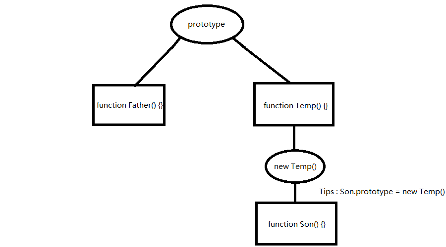

# 继承发展史

- 传统形式 : 原型链 ( 过多地继承了没用的属性 )

- 使用 call/apply 来借用别的方法实现自己的功能 ( 不能继承借用的构造函数的原型 )

- 共享原型 ( 无法实现原型A既继承原型B的属性又同时拥有自己的独有属性 )

  ```
  function Father() {}
  function Son() {}

  function inherit(Target, Origin) {
    Target.prototype = Origin.prototype;
  }

  inherit(Son, Father);
  ```

- **圣杯模式**

  

  - 通俗写法

    ```
    function inherit(Target, Origin) {
      var F = function () {}
      F.prototype = Origin.prototype;
      Target.prototype = new F();
      Target.prototype.constructor = Target;
      Target.prototype.uber = Origin.prototype;
    }
    ```

  - 结合闭包 , 将中间函数F私有化

    ```
    var inherit = (function () {
      var F = function () {}
      return function(Target, Origin) {
        F.prototype = Origin.prototype;
        Target.prototype = new F();
        Target.prototype.constructor = Target;
        Target.prototype.uber = Origin.prototype;
      }
    }())
    ```
