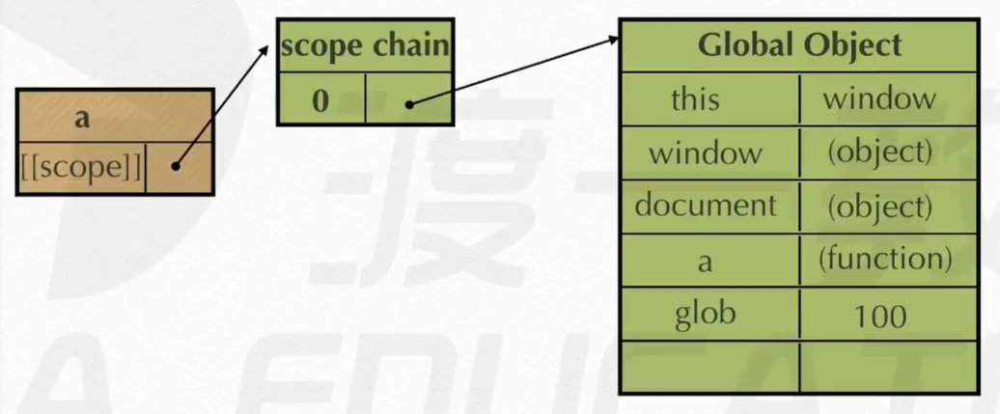
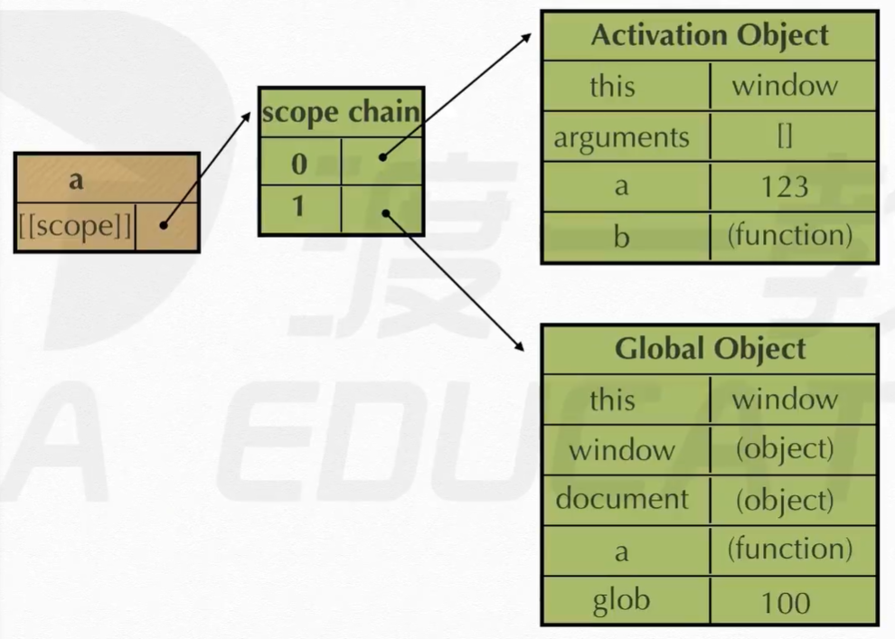
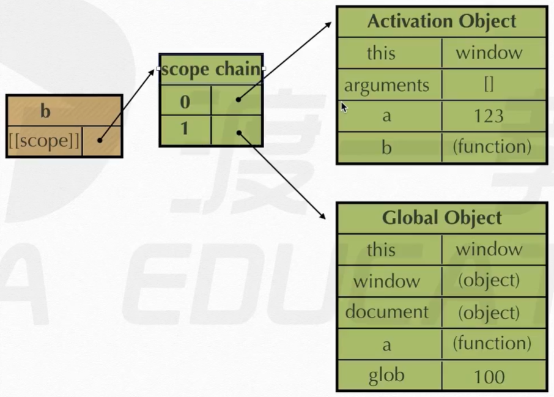
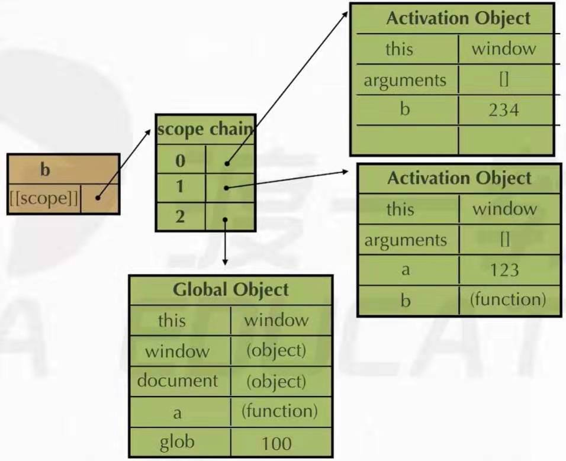

# 作用域、作用域链

- 变量
  - 全局变量
  - 局部变量( 函数内部的变量 )

- 作用域定义
  - 变量( 变量作用域又称上下文 )和函数能被访问的区域

- 作用域的访问顺序( 内部的可以访问外部的 )

- 执行期上下文 : **在函数刚要执行的前一刻 , 会创建一个称为执行期上下文的内部对象** 。一个执行期上下文定义了一个函数执行时的环境 , 函数每次执行时对应的执行期上下文都是独一无二的 , 所以多次调用一个函数会创建多个执行期上下文 , 当函数执行完毕 , 它所产生的执行期上下文会被销毁 ( 断线 ) 。

- ```[[scope]]``` : 每个js函数都是一个对象 , 对象中有些属性我们可以访问 , 但有些不可以 , 这些属性仅供js引擎存取 , ```[[scope]]```就是其中一个 。```[[scope]]```指的就是我们所说的作用域链 , 其中存储了执行期上下文的集合 。

  ```
  function test() {} // test.[[scope]] --> 作用域链
  ```

- 作用域链 : ```[[scope]]```中所存储的执行期上下文对象的集合 , 这个集合呈链式链接 , 我们把这种链式链接叫做作用域链 。

- 查找变量 : 在哪个函数里面查找变量 , 就从哪个函数的作用域链的顶端依次向下查找 。

-------------------------------
> Demo
```
function a() {
  function b() {
    var b = 234;
  }
  var a = 123;
  b();
}
var glob = 100;
a();
```

- 函数 a 被定义时 , 发生如下过程



- 函数 a 被执行时 , 发生如下过程



- 函数 b 被定义时 , 发生如下过程



- 函数 b 被执行时 , 发生如下过程



---------------------------------------
> Test
```
function a() {
  function b() {
    function c() {}
    c();
  }
  b();
}
a();

GO {
  a: function a() {...}
}
AO_a {
  b: function b() {...}
}
AO_b {
  c: function c() {...}
}
AO_c {}

// 倒着看！！！
```
