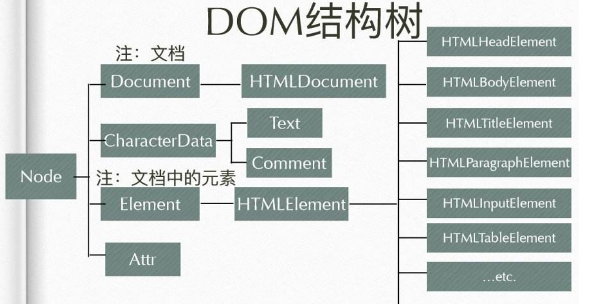

# DOM操作初探

- Document Object Model

- DOM对象( 宿主对象 )由浏览器厂商定义 , 是一套用来表示和操作html和xml的方法的集合

- 也有人称DOM是对html以及xml的标准编程接口

- DOM无法直接操作CSS样式表 , 但可通过以下两种方式改变DOM节点的样式 ( 可参考ChooseCard选项卡组件 )

    - 动态内联样式 style

    - 动态类名 active

- DOM结构树

