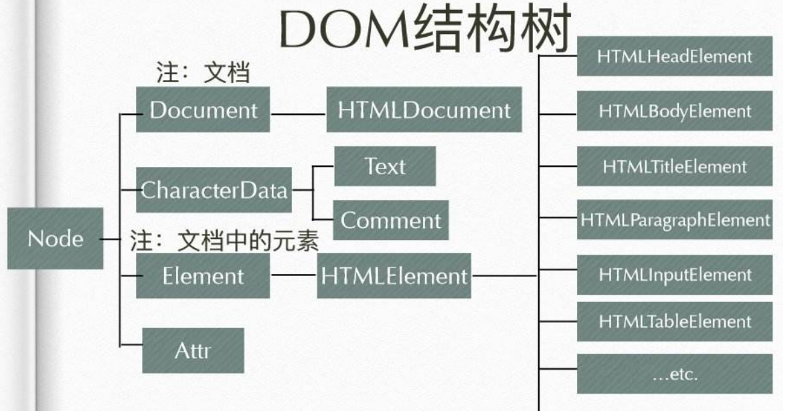

# DOM继承树，DOM基本操作

- 先回想一下原型的知识

- Document是一个系统内置的只读构造函数

- 但我们可以在Document.prototype上挂载各种属性和方法

- document对象就可以顺着原型链访问调用这些自定义的属性和方法

- 但document的构造函数是HTMLDocument

- DOM继承树

  

-----------------------------------------

> DOM基本操作

```
  Document.prototype = {
    documentElement, // 文档的根元素
    getElementById: fn,
    getElementsByTagName: fn,
    getElementsByClassName: fn,
    querySelector: fn,
    querySelectorAll: fn,
    ...
  }

  HTMLDocument.prototype = {
    head,
    body,
    getElementsByName: fn,
    ...
  }

  Element.prototype = {
    getElemetsByTagName: fn,
    getElementsByClassName: fn,
    querySelector: fn,
    querySelectorAll: fn,
  }
```

- 因为getElementsByTagName具有良好的兼容性( 在Document.prototype和Element.prototype上均有定义 )，所以综合考虑代码可读性和兼容性，JS选中元素的更好方式如下

```
  // html
  <div>
    <span></span>
  </div>
  <span></span>

  // js
  var oDiv = document.getElementsByTagName('div')[0];
  var oSpan = oDiv.getElementsByTagName('span')[0];
```

